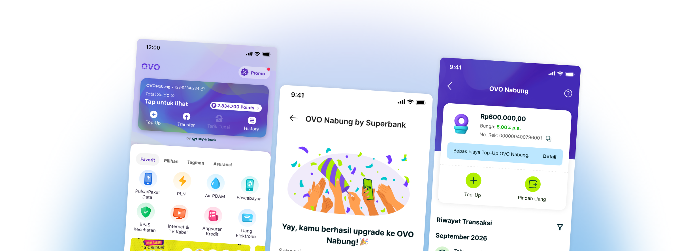

# OVO Nabung by Superbank

Roles: UX Designer
Tags: UX Design, UX Research
Timeline: Q4 2024
Collaborators: 3 UX Designers, 1 UX Writer, 3 Project Managers
Status: New

# Project Overview

**OVO Nabung by Superbank** is a joint initiative that bridges the gap between everyday digital payments and formal banking. While **OVO possesses a user base of millions** utilizing its e-wallet for high-frequency daily transactions, **Superbank recently entered the market with low user acquisition**. By embedding a high-yield savings product directly into the OVO ecosystem, this initiative converts passive spenders into active savers, offering an attractive **5% p.a. interest rate** with zero friction.

# Outcome & Impact

## +1 Million

Registered Users after 60 days

## 60% Users

Coming from OVO Nabung integration

- 2,3 million+ total users of OVO Nabung
- 3x offline transaction growth for merchant transaction using OVO Nabung
- On-demand service growth: Usage across GrabFood, GrabBike, and GrabCar more than doubled.

# Problem Statement & User Segment

Most e-wallet users keep money in their accounts for daily purchases (e.g., Grab, offline QRIS, bill payments). However, standard e-wallet balances earn 0% interest and incur top-up fees. Opening a separate digital bank app introduces friction (extra KYC, app switches, manual transfers). 

Digital banking users often face fragmentation between where they keep their savings (high-yield bank accounts) and where they spend their money (e-wallets, QRIS, daily merchants). Transferring funds back and forth creates friction, fee fatigue, and idle balance losses.

`[image of user segmentation & solution]`

## Key user insights

- **High Friction:** Users do not want to download another banking app for daily savings.
- **Friction in Multi-App Journeys:** Users dropping off during cross-app handoffs
- **Low Financial Literacy on Yield:** Users want interest earnings, but traditional banking terms feel complex.

---

# Approach

While ecosystem onboarding and initial triggers are initiated on the OVO platform, my primary ownership was focused on **delivering a seamless experience inside the Superbank app** while co-creating cross-stream alignment across the entire user journey.

### Core Responsibilities & Contribution

1. **Superbank In-App Experience (Direct Ownership):** Designed the core savings dashboard, Saku setup and management flows, and payment execution UX inside Superbank.
2. **Saku & Savings Structure (Direct Ownership):** Created the interaction models for high-yield savings allocation, enabling users to set aside funds while keeping main balances liquid for ecosystem payments.
3. **Transactions & Payment UX (Direct Ownership):** Designed frictionless QRIS payments, transfer flows, and transaction histories that correctly reflect ecosystem-linked balances.
4. **Cross-Stream Collaboration (Co-Creation):** Worked directly with OVO team to define consistent micro-copy, shared design token definitions, edge-case error states, and seamless deep-linking behavior between OVO and Superbank.

## Cross-stream integration touchpoints

**Smooth App Handshakes:** Designed seamless transition states and deep links when returning from OVO onboarding back into Superbank.

**Consistent Design Language:** Standardized component behavior and micro-copy for financial terminology across both apps to maintain user trust.

## Using Saku architecture to create seamless experience in app

Designed the modular **Saku** interface inside Superbank to allow users to organize savings while staying fully connected to their ecosystem payment balance

## Streamlined payment experience

Streamlined payment execution within Superbank to mirror the speed and familiarity of top-tier e-wallets:

- **Unified Payment Drawer:** Optimized QRIS and transfer screens so users can select funding sources (Main Account vs. eligible liquid Saku) without abandoning transaction flows.
- **Real-time Balance Feedback:** Clear receipts and status screens detailing interest earned vs. amount spent after every transaction.

---

# Reflections & Insights

Ecosystem UX extends beyond a single app's interface—it requires seamless cross-stream handshakes to prevent drop-offs across the user's entire journey. Success lies in balancing high-yield savings (Saku) with instantaneous e-wallet payments through a clear balance hierarchy and contextual safeguards. 

Post-launch feedback showing user still struggle to understand how the interest rate and how the balance works between two platforms. There are also few concern on the integration process to deliver a clear value when user decides to integrate their account.