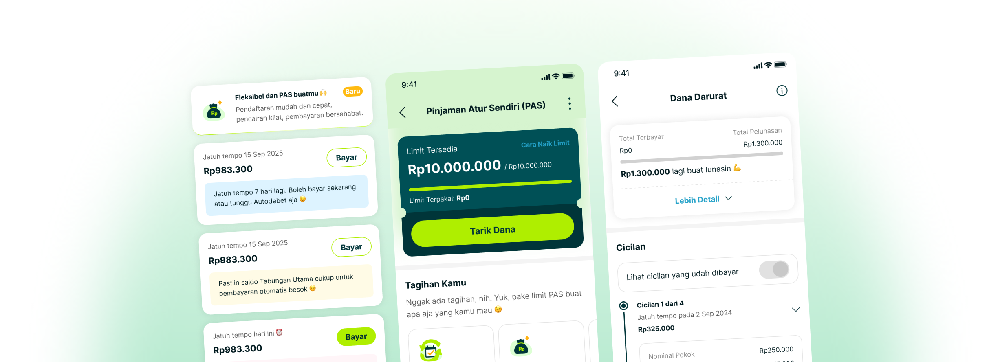

# PAS Cash by Superbank: Empowering Financial Flexibility

Roles: UX Designer
Tags: UX Design, UX Research
Timeline: Q1 2024
Collaborators: 1 UX Writer, 2 UX Designers, 2 Project Managers
Status: New

# Project Overview

**PAS Cash** (Pinjaman Atur Sendiri) is an unsecured digital loan product developed by **Superbank.** The project tackled systemic pain points in Indonesia's digital lending market, where users often faced **rigid repayment structures, complex application processes, and limited fee transparency.**

Through an **embedded banking** strategy, PAS Cash was integrated directly into widely used ecosystem applications, including **Grab** and **OVO** [PAS Cash, Kolaborasi]. This approach turned digital borrowing from an intimidating external process into a transparent, user-controlled tool embedded in users' daily digital routines.

# Business Impact vs. UX Metrics

Superbank’s growth was driven by a dual-track ecosystem strategy. Innovative savings features, including *OVO Nabung* and *Celengan*, increased deposits, while **PAS Cash remained the primary driver of credit expansion and asset utilization.**

We evaluated these design interventions using both user experience (UX) and business key performance indicators (KPIs).

---

# User Segmentation

To design an intuitive financial product, we identified and analyzed three key user segments across the Grab and OVO ecosystems. These groups represent a large population of *underbanked* people in Indonesia who have digital transaction histories but limited access to traditional banking credit.

| **Gig Economy Workers (Independent Drivers & Delivery Partners)** | **Micro-Merchants & MSMEs (Food & Retail Vendors)** | **Digital-Native Professionals (Gen Z & Early Millennials)** |
| --- | --- | --- |
|   • Profile: Active ride-hailing drivers and delivery partners who rely heavily on daily or weekly platform incentives.
  • Financial Behavior: Financial inflows are fluid and variable rather than fixed monthly salaries. This group requires rapid access to short-term capital for vehicle maintenance, fuel, or urgent family needs.
  • UX Focus: Mobile-first, highly efficient interfaces optimized for on-the-go interactions with minimal data input. |   • Profile: Small business owners operating via digital merchant applications (e.g., GrabFood, GrabMart).
• Financial Behavior: High frequency of daily cash turnarounds but frequently hindered by sudden inventory shortages or seasonal supply demands. They need a predictable, recurring credit facility rather than single-use loans.
• UX Focus: Clear transaction dashboards displaying real-time available balances and direct options for revolving credit withdrawal. |   **• Profile:** Salaried corporate employees who use digital wallets as their primary payment method for lifestyle, bills, and daily transportation.
  • **Financial Behavior:** Steady monthly income but highly susceptible to mid-month cash constraints due to emergency expenses or life milestones.
  • **UX Focus:** Modern visual design, transparent digital documentation, and automated scheduling that matches their specific corporate paydays. |

# Problem Statement

User research and market analysis identified three key pain points in Indonesia’s traditional digital lending platforms:

1. **Rigid Payment Schedules:** Most digital lending apps set fixed repayment deadlines. When a deadline doesn’t align with a borrower’s payday, it can create financial strain and increase the risk of repayment difficulties.
2. **Opaque Pricing Structures:** Users were often anxious about hidden administrative fees when the amount disbursed was lower than expected, with no clear explanation.
3. **Application Fatigue:** Traditional applications required repeated document submissions, lengthy forms, and long verification periods, leading to high registration drop-off rates.

---

# Approach

## The Discovery

**The UX Solution** 

New-to-Bank users can discover the PAS offering during onboarding and choose to opt in immediately or later.

Instead of intrusive pop-up banners, we integrated PAS directly into the Superbank home screen as a clean, minimal widget.

**Ecosystem Synergy**

We also added small, contextual entry points within partner apps like Grab and OVO, such as a "Need extra cash?" shortcut near the digital wallet screen.

**Copywriting Tone**

We kept the language simple and friendly, with a strong emphasis on flexibility and no hidden fees.

## Borrowing Experience

### **The Interactive Customization Slider**

Rather than limiting users to fixed multi-month payment structures, the interface introduced an interactive slider mechanic.

- **UX Solution:** Users can adjust the slider to select precise loan amounts and **manually designate their preferred repayment date** to match their cash flow.
- **Micro-interaction:** The interface dynamically computes and displays daily interest calculations in real-time as the slider moves, providing immediate financial clarity.

### **Upfront Cost Breakdowns**

To mitigate user distrust regarding hidden platform fees, the team designed a structured, card-based summary page prior to the final loan confirmation step.

- **UX Solution:** The UI establishes a strict visual hierarchy separating the "Disbursed Amount" from the "Total Repayment Amount." Complex text terms were replaced with clear, contextual tooltips.

## Repayment

After disbursement, help users manage repayments confidently without feeling overwhelmed.

### **Clear Hierarchy**

The page highlights only three critical pieces of information: **Total Remaining Balance**, **Next Payment Amount, and Remaining loan repayment.**

### Dynamic Reminders

Instead of using harsh text alerts or an intrusive interface, dynamic cards were introduced so users wouldn’t receive spammy notifications until seven days before a payment was due. This helps users feel at ease while politely reminding them of their repayment obligations.

</img>

We also give users the flexibility to repay individual loans early. They can choose which loan to pay off first, reducing their total outstanding balance by the due date according to their preferences.

---

# Impact

## 2.10% Gross NPL

in 2025, down from 3.80% in 2023

## +4 Million

Active users from PAS and its integration with the GROVO ecosystem

## Rp6.2 Trillion

Total gross loan disbursements, up from Rp2.92 trillion

---

# What I Learned

Designing PAS by Superbank taught us that the success of a financial product depends on balancing user psychology with ecosystem integration. While transparency is vital, we discovered a clear boundary: displaying all applicable fees upfront did not deter users; instead, it built strong institutional trust and encouraged repeated use of the credit limit. However, there is a fine line between being transparent and becoming overwhelming. Indonesian users can experience cognitive fatigue when presented with too many dense financial figures at once. Bridging this gap—delivering complete transparency without causing information overload—remains an ongoing design challenge that requires continual visual simplification.

From a strategic standpoint, we validated that user autonomy and contextual placement are key drivers of growth and risk reduction. Integrating our lending service directly into the Grab and OVO networks allowed us to meet users at their exact point of need, reducing friction and naturally increasing conversions. More importantly, giving users the flexibility to align their repayment dates with their actual income streams proved to be a mutually beneficial design choice. This approach significantly reduced default rates, protecting the bank’s asset quality while giving users a stress-free experience that respects their real-life financial cycles.